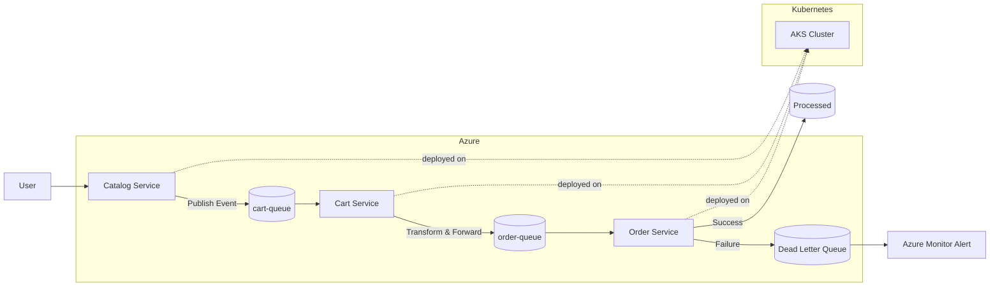

# 🚀 ReadIt — Azure Event-Driven Microservices Architecture

## 📌 Overview

ReadIt is a cloud-native event-driven microservices project built on Azure.

The project focuses less on feature richness and more on understanding how distributed systems behave at runtime.

The main objective is to explore and practice:

* Event-driven architecture
* Distributed systems debugging
* Cloud-native operations
* Observability and telemetry
* Kubernetes runtime management
* Failure handling and resilience patterns

Rather than simulating a “fully production-ready platform”, this project intentionally focuses on operational learning and real-world engineering challenges commonly encountered in distributed systems.

---

# ✨ Highlights

* Azure Kubernetes Service (AKS)
* Azure Service Bus
* Event-driven microservices architecture
* Producer / Consumer messaging model
* Retry + Dead Letter Queue (DLQ)
* CorrelationId-based message tracing
* Structured application logging
* OpenTelemetry instrumentation
* Azure Application Insights integration
* Azure Monitor alerting
* Infrastructure as Code with Terraform
* Kubernetes deployments & rollouts
* Dockerized services
* GitHub Actions CI/CD

---

# 🧠 Learning Goals

This project was designed as a hands-on exploration of:

* Asynchronous communication patterns
* Distributed message processing
* Failure visibility and debugging
* Runtime observability
* Kubernetes operational workflows
* Resilience engineering concepts
* Cloud-native troubleshooting

---

# 🏗️ Architecture Evolution

The architecture was developed iteratively to simulate how distributed systems evolve over time.

---

## Phase 1 — Initial Synchronous Design

Initial architecture with:

* Catalog service
* Cart service
* Basic service-to-service communication

Goal:
Establish a simple microservices foundation.

---

## Phase 2 — Azure Service Bus Integration

Introduction of asynchronous messaging using Azure Service Bus.

New concepts introduced:

* Queue-based communication
* Producer / Consumer pattern
* Decoupled services

Flow:

Catalog → Service Bus → Cart

---

## Phase 3 — Event-Driven Architecture

The architecture evolved toward an event-driven design.

Focus areas:

* Loose coupling
* Distributed processing
* Independent service responsibilities

---

## Phase 4 — Cart as Message Processor

The Cart service evolved into an intermediate message processor.

Responsibilities:

* Consume messages from `cart-queue`
* Validate and transform payloads
* Forward events to `order-queue`

---

## Phase 5 — Dedicated Order Service

A dedicated Order service was introduced as the final consumer.

Updated flow:

Catalog → cart-queue → Cart → order-queue → Order

---

## Phase 6 — Resilience & Failure Handling

Production-oriented resilience mechanisms were added:

* Automatic retries
* Dead Letter Queue (DLQ)
* Controlled failure simulation
* Poison message handling
* Message durability validation

---

## Phase 7 — Monitoring & Observability

Observability and monitoring capabilities were introduced.

Implemented features:

* Structured logs
* CorrelationId propagation
* Retry visibility
* DLQ monitoring
* Azure Monitor alerts
* OpenTelemetry instrumentation
* Azure Application Insights integration

---

# 🏗️ Core Components

| Component            | Role                      |
| -------------------- | ------------------------- |
| Catalog Service      | Event Producer            |
| Cart Service         | Message Processor         |
| Order Service        | Final Consumer            |
| Azure Service Bus    | Messaging Backbone        |
| AKS                  | Container Orchestration   |
| ACR                  | Container Registry        |
| Azure Monitor        | Monitoring & Alerts       |
| Application Insights | Telemetry & Observability |

---

# 🔄 End-to-End Flow

User → Catalog → cart-queue → Cart → order-queue → Order

---

# 🧱 Architecture Diagram



---

# 📊 Monitoring & Observability

The project includes observability features inspired by real-world distributed systems operations.

---

## Implemented

* Structured application logs
* CorrelationId-based tracing
* Azure Monitor alerting
* DLQ monitoring
* Retry visibility
* OpenTelemetry spans
* Azure Application Insights integration
* Runtime telemetry collection

---

## Example Logs

### Successful Processing

```text
📦 [RECEIVED]
🔗 CorrelationId=3953a2f7-e40c-4624-a0cd-d3231aa3d693
🟢 [PROCESSING]
✅ [SUCCESS]
```

---

### Failure Scenario

```text
❌ [ERROR] CorrelationId=alert-test
❌ Message moved to DLQ
📧 Azure Monitor Alert Triggered
```

---

## ## OpenTelemetry Runtime Trace Example
Example of a custom OpenTelemetry span generated during asynchronous order processing inside AKS.
```text
Activity.TraceId:            42e288fb61e0c78b85c06e5c7468f0c9
Activity.SpanId:             a21e0621d0036a92
Activity.TraceFlags:         Recorded
Activity.ActivitySourceName: readit.order
Activity.DisplayName:        process-order
Activity.Kind:               Internal
Activity.StartTime:          2026-05-08T08:27:25.3766718Z
Activity.Duration:           00:00:00.0809132
```

---

# 💥 Failure Handling

The architecture includes resilience mechanisms inspired by distributed cloud systems.

---

## Retry Strategy

Azure Service Bus automatically retries failed messages before dead-lettering them.

Examples:

* Temporary processing issues
* Simulated runtime failures
* Transient consumer problems

---

## Dead Letter Queue (DLQ)

Messages are automatically moved to DLQ after repeated failures.

Examples:

* Invalid payloads
* Schema validation failures
* Processing exceptions
* Poison messages

---

## Monitoring

Azure Monitor alerts are triggered when DLQ activity increases.

This allows early visibility into queue processing problems.

---

# 🔧 Real Engineering Challenges Encountered

During development, several operational and distributed systems issues were identified and resolved:

* Messages stuck in queues
* Consumers silently stopping
* Wrong queue configuration
* Kubernetes rollout inconsistencies
* Docker image version mismatch
* Dependency/package conflicts
* DLQ accumulation
* Monitoring configuration issues
* Nested JSON payload problems
* Runtime configuration issues
* Service Bus authentication failures
* OpenTelemetry package compatibility issues

During deployment validation, a runtime framework mismatch caused new pods to enter CrashLoopBackOff while previous healthy replicas continued serving traffic, illustrating Kubernetes rolling deployment resilience behavior.
A strong focus of the project was understanding runtime behavior and debugging distributed systems under failure scenarios.

---

# ☸️ Kubernetes Operations

The project also focuses on day-to-day Kubernetes operational workflows.

Examples:

* Pod inspection
* Log streaming
* Deployment rollouts
* Image updates
* Runtime debugging
* Secret injection
* Configuration troubleshooting

Common commands used:

```bash
kubectl get pods
kubectl get svc
kubectl logs -l app=order -f
kubectl rollout status deployment/order-deployment
kubectl set image deployment/order-deployment ...
```

---

# 📁 Project Structure

```text
readit-azure-architecture/
├── catalog-service/
├── cart-service/
├── order-service/
├── terraform/
├── kubernetes/
└── docs/
```

---

# 📚 Documentation

- [Architecture](docs/architecture.md)
- [Deployment Guide](docs/deployment.md)
- [Testing](docs/testing.md)
- [Notifications](docs/Notifications.png)
- [DLQ Metrics](docs/DLQ.png)
- [AKS Pods](docs/Pods.png)
- [App Insights](docs/App_Insights_Dependencies.png)


---

# ⚠️ Common Issues

| Issue                      | Cause                            |
| -------------------------- | -------------------------------- |
| ImagePullBackOff           | Wrong image tag / ACR access     |
| CreateContainerConfigError | Missing secret                   |
| Service Bus 401            | Invalid connection string        |
| No message processing      | Queue / consumer issue           |
| DLQ accumulation           | Processing failures              |
| Old code still running     | Deployment rollout inconsistency |

---

# 🚧 Current State & Limitations

Implemented:

* OpenTelemetry instrumentation
* Azure Application Insights integration
* Structured telemetry
* CorrelationId propagation
* Retry & DLQ handling
* Runtime monitoring

Current limitations:

* No full distributed trace propagation across services yet
* No centralized observability dashboards
* Limited schema validation
* No persistent idempotency handling
* No autoscaling policies yet
* No service mesh integration

These areas are intentionally left as future learning opportunities.

---
🔭 Future Learning Direction

The next iteration of this learning journey will explore IoT and telemetry-driven architectures, focusing on device communication, telemetry ingestion and operational monitoring in cloud-native environments.

---

# 💡 Key Insight

> In distributed systems, deployment is only the beginning.

Reliable cloud systems require visibility into:

* Runtime behavior
* Failures
* Retries
* Queue processing
* Observability
* Operational debugging

This project focuses heavily on understanding those operational realities in cloud-native architectures.
