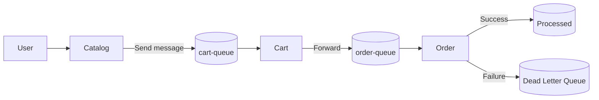

# 🚀 ReadIt - Azure Microservices Architecture

## 📌 Overview

ReadIt is a cloud-native microservices application demonstrating a production-like Azure architecture.

It showcases how to design, deploy and debug distributed systems using:

- Azure Kubernetes Service (AKS)
- Azure Container Registry (ACR)
- Azure Service Bus
- Terraform (Infrastructure as Code)

---

## 🧠 Architecture Evolution

This project was developed iteratively to reflect real-world system design:

### Phase 1 — Basic Microservices
- Catalog + Cart
- Simple communication mindset

### Phase 2 — Service Bus Integration
- Catalog → Service Bus → Cart
- Introduction of asynchronous communication

### Phase 3 — Event-Driven Architecture
- Decoupled services
- Producer / Consumer model

### Phase 4 — Cart as Processor
- Consumes from `cart-queue`
- Transforms and forwards messages

### Phase 5 — Order Service
- New service added as final consumer

New flow:

Catalog → cart-queue → Cart → order-queue → Order

### Phase 6 — Resilience (DLQ)
- Retry mechanism (Service Bus)
- Dead Letter Queue (DLQ) implemented
- Failure simulation validated system robustness

---

## 🏗️ Architecture

- Catalog Service → Producer
- Cart Service → Processor
- Order Service → Consumer
- Azure Service Bus → Messaging backbone


## 🔄 Flow

Catalog → cart-queue → Cart → order-queue → Order


## 🧱 System Overview


---

## 📁 Structure
```
readit-azure-architecture/
├── catalog-service/
├── cart-service/
├── order-service/
├── terraform/
├── kubernetes/
└── docs/
```
---

## 📚 Documentation

- [Architecture](docs/architecture.md)
- [Deployment Guide](docs/deployment.md)
- [Testing](docs/testing.md)

---

## 💡 Key Concepts

- Asynchronous communication
- Event-driven architecture
- Loose coupling between services
- Message transformation
- CorrelationId propagation
- Retry mechanism
- Dead Letter Queue (DLQ)

# 💥 Failure Handling

- Automatic retries handled by Service Bus
- Message moved to DLQ after max attempts
- No message loss
- System resilience validated through forced failures
 
 ---
⚠️ Common Issues
- ImagePullBackOff → wrong tag / ACR access
- CreateContainerConfigError → missing secret
- Service Bus 401 → wrong configuration
- No message processing → wrong queue / consumer not connected

⚠️ Current Limitations
- No monitoring / observability yet
- No schema validation
- No idempotency handling
- Nested JSON in message payload (to be improved)

🚀 Next Step

- Monitoring & Observability (Azure Monitor, metrics, alerting)
---