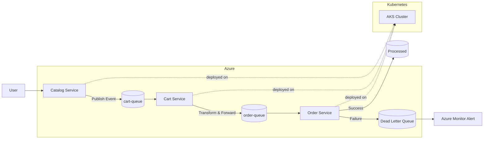

# 🚀 ReadIt - Azure Microservices Architecture

## 📌 Overview

ReadIt is a cloud-native event-driven microservices project built on Azure.

The goal of this project is not only to deploy services, but also to understand, debug and monitor distributed systems in production-like environments.

The architecture demonstrates:

- Asynchronous communication
- Distributed message processing
- Retry & Dead Letter Queue (DLQ)
- Kubernetes operations
- Monitoring & observability
- Failure handling in distributed systems

---

## ✨ Highlights

- Azure Kubernetes Service (AKS)
- Azure Service Bus
- Event-driven architecture
- Retry + Dead Letter Queue (DLQ)
- CorrelationId distributed tracing
- Structured application logging
- Azure Monitor alerting
- Infrastructure as Code with Terraform
- Kubernetes deployments & rollouts

---

# 🧠 Architecture Evolution

This project was developed iteratively to simulate real-world architecture evolution.

---

## Phase 1 — Initial Synchronous Design

- Catalog + Cart services
- Simple service communication
- Basic microservices foundation

---

## Phase 2 — Service Bus Integration

- Introduction of Azure Service Bus
- Asynchronous communication
- Producer / Consumer model

Flow:

Catalog → Service Bus → Cart

---

## Phase 3 — Event-Driven Architecture

- Services decoupled
- Queue-based communication
- Distributed processing mindset

---

## Phase 4 — Cart as Message Processor

Cart service became an intermediate processor:

- Consumes messages from `cart-queue`
- Transforms payloads
- Forwards messages to `order-queue`

---

## Phase 5 — Order Service

A dedicated Order service was added as the final consumer.

New flow:

Catalog → cart-queue → Cart → order-queue → Order

---

## Phase 6 — Resilience & Failure Handling

Production-style resilience mechanisms were introduced:

- Automatic retries
- Dead Letter Queue (DLQ)
- Controlled failure simulation
- Message durability validation

---

## Phase 7 — Monitoring & Observability

Monitoring capabilities were added:

- Structured logging
- CorrelationId tracing
- Azure Monitor alerts
- DLQ monitoring
- Distributed debugging workflow

---

# 🏗️ Architecture

## Services

| Service | Role |
|---|---|
| Catalog Service | Producer |
| Cart Service | Message Processor |
| Order Service | Final Consumer |
| Azure Service Bus | Messaging Backbone |
| AKS | Container Orchestration |
| ACR | Container Registry |

---

# 🔄 End-to-End Flow

User → Catalog → cart-queue → Cart → order-queue → Order

---

# 🧱 Architecture Diagram



---

# 📊 Monitoring & Observability

The system includes production-style monitoring features.

## Implemented

- Structured application logs
- CorrelationId propagation
- Azure Monitor alerting
- DLQ monitoring
- Retry visibility
- End-to-end message tracing

---

## Example Logs

### Successful Processing

```text
📦 [RECEIVED]
🔗 CorrelationId=3953a2f7-e40c-4624-a0cd-d3231aa3d693
🟢 [PROCESSING]
✅ [SUCCESS]
```

---

### Failure Scenario

```text
❌ [ERROR] CorrelationId=alert-test
❌ Message moved to DLQ
📧 Azure Monitor Alert Triggered
```

---

# 🔧 Production Challenges Solved

During development, several real-world distributed system issues were identified and resolved:

- Messages stuck in queues
- Consumers silently stopping
- Wrong queue configuration
- Kubernetes rollout inconsistencies
- Docker image version mismatch
- DLQ accumulation
- Monitoring alert configuration issues
- Nested JSON payload problems

This project focuses heavily on debugging and understanding runtime behavior in distributed systems.

---

# 💥 Failure Handling

The architecture includes resilience mechanisms inspired by production systems.

## Retry Logic

- Automatic retries managed by Azure Service Bus
- Messages retried before dead-lettering

---

## Dead Letter Queue (DLQ)

Failed messages are automatically moved to DLQ after repeated failures.

Example scenarios:

- Invalid payload
- Processing exception
- Simulated failure

---

## Monitoring

Azure Monitor alerts are triggered when DLQ activity increases.

---

# 📁 Project Structure

```text
readit-azure-architecture/
├── catalog-service/
├── cart-service/
├── order-service/
├── terraform/
├── kubernetes/
├── docs/
└── screenshots/
```

---

# 📚 Documentation

- [Architecture](docs/architecture.md)
- [Deployment Guide](docs/deployment.md)
- [Testing](docs/testing.md)
- [Notifications](docs/Notifications.png)
- [DLQ Metrics](docs/DLQ.png)
- [AKS Pods](docs/Pods.png)

---
# ⚠️ Common Issues

| Issue | Cause |
|---|---|
| ImagePullBackOff | Wrong image tag / ACR access |
| CreateContainerConfigError | Missing secret |
| Service Bus 401 | Wrong configuration |
| No message processing | Wrong queue / consumer issue |
| DLQ accumulation | Processing failure |
| Old code still running | Deployment rollout issue |

---

# 🚧 Current Limitations & Next Steps

The architecture is continuously evolving.

Planned improvements:

- OpenTelemetry integration
- Azure Application Insights
- Distributed tracing dashboard
- Schema validation
- Idempotency handling
- GitHub Actions CI/CD improvements
- Centralized observability dashboards
- Load testing & scaling validation

---

# 💡 Key Insight

This project focuses on a critical engineering reality:

> In distributed systems, deployment is only the beginning.

Understanding failures, retries, observability and runtime behavior is what makes cloud systems reliable.