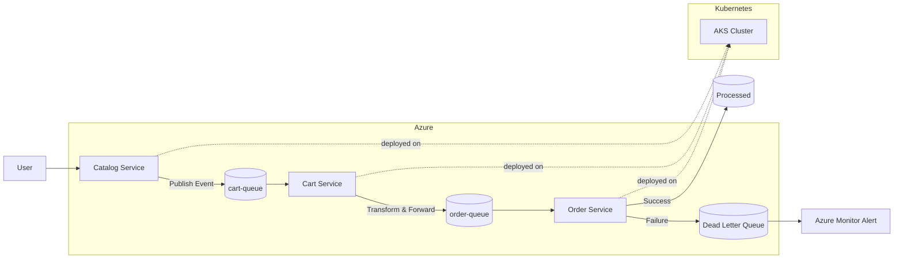

# 🧱 Architecture Diagram

```mermaid
flowchart LR

    User[User] --> Catalog[Catalog Service]

    Catalog -->|Publish Event| CartQueue[(cart-queue)]

    CartQueue --> Cart[Cart Service]

    Cart -->|Transform & Forward| OrderQueue[(order-queue)]

    OrderQueue --> Order[Order Service]

    Order -->|Success| Success[(Processed)]

    Order -->|Failure| DLQ[(Dead Letter Queue)]

    DLQ --> Alert[Azure Monitor Alert]

    subgraph Azure
        Catalog
        Cart
        Order
        CartQueue
        OrderQueue
        DLQ
    end

    subgraph Kubernetes
        AKS[AKS Cluster]
    end

    Catalog -. deployed on .-> AKS
    Cart -. deployed on .-> AKS
    Order -. deployed on .-> AKS
```